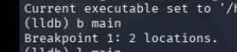

# H6 - GDB Homework

## Task :

<aside>

In class, we saw how to use GDB for debugging and changing the program’s runtime behavior. We used rust-gdb to do this, but it was sometimes clumsy, and support on ARM-based PCs was limited. We also mentioned that LLVM tools often work better with Rust and have a more modern design.

Your task is to repeat the same examples we did in class, but using LLDB. Your challenge is to find the equivalent commands in LLDB yourself (breakpoints, printing values, inspecting state, etc.).

1. Watch a value change in a loop
2. Modify a return value from false to true
3. Modify a function argument (try both a local variable and register manipulation)
4. Compare your experience to the slides: did you find it easier? Which tool would you use, and when?

There’s also a rust-lldb wrapper for your convenience.

</aside>

## Steps

### Installation

I installed LLDB using the command `sudo apt-get install lldb` . 

I downloaded the Dynamic analysis folder and unzipped it. 

### 1. Watch the value change

I recompiled the code with `cargo b`  Command

I run the exercice seen during class with lldb `rust-lldb target/debug/concat` 

I set up a breakpoint at main, with the command `b main`  

I will check the main function to spot the value that change in a loop with command `l main`  

 Now i will set a watchpoint on the n variable with `watchpoint set variable n`

Now by using `c` we can see the n variable being changed overtime

I also used the `display result` to display the change more clearly: 

### 2. Modify a return value from false to true

For this exercice, we’ll use the check-pin code. 

So we want to get a success message, even with a wrong pin written.

I list the full code to see the check function with `l main` then `enter` until the full code is displayed : 

I add a breakpoint to `check_password`  with `b check_password` .

now i type a wrong pin `0000`

now we force the return of true with `thread return true` 

I’m in. 

### 3. Modify a function argument

To change the argument in a function. i’ll put a breakpoint to the check_password function with `b check_password` . 

Then i run  the program and type a wrong password `0000` 

Now i want to erase the lhs value with something else so i’ll use `expr lhs = 1235` 

it seems that i changed the value of Lhs but it wrong because of the registry.

we’ll modify the registry directly. I launch the program again `r`  

i type the wrong pass `0000` but this time i’ll change the registry value `register write $arg1 1235` 

This time it worked. 

### 4. Compare your experience to the slides.

GDB got a more direct syntax `watch n` → `watchpoint set variable n` 

I’d use LLDB for modern language. 

## Lab 0

Like indicated, there’s a buffer overflow in the code. we’ll modify it behavior to get a correct excecution : 

first i put a break point at the function `b buggy_function`

i keep running the program

then i change the value of the variable `set size = 4`  and continue the execution

the execution of the program continued and exited correctly. 

## Lab 1

I opened th file with gbd and check the print_scrambled function with `list print_scrambled` 

I’m unsure of what need to be done, but i’ll assume that we need to cancel the cesar cipher aplied here. 

we’ll set a break point before the loop but after the `i`  initialization with `b 6` 

then i run the program and set the `i` variable to 0 to cancel the change `set var i = 0` 

then i delete the breakpoint and finish the execution of the program

The code now print “Hello, world.” like expected.